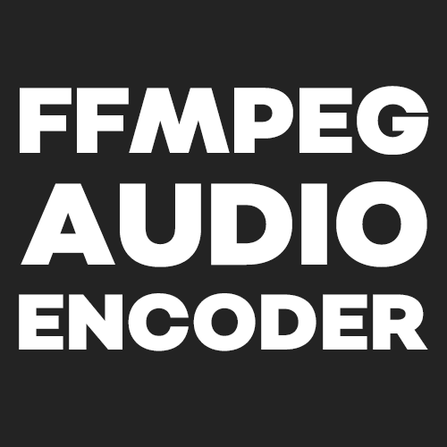

<!-- PROJECT SHIELDS -->
<!--
*** I'm using markdown "reference style" links for readability.
*** Reference links are enclosed in brackets [ ] instead of parentheses ( ).
*** See the bottom of this document for the declaration of the reference variables
*** for contributors-url, forks-url, etc. This is an optional, concise syntax you may use.
*** https://www.markdownguide.org/basic-syntax/#reference-style-links
-->
[![Contributors][contributors-shield]][contributors-url]
[![Forks][forks-shield]][forks-url]
[![Stargazers][stars-shield]][stars-url]
[![Issues][issues-shield]][issues-url]
[![MIT License][license-shield]][license-url]

<!-- PROJECT LOGO -->
 

  

<h3 align="center">FFMPEG Audio Encoder</h3>

  

    A small batch script designed to modify the audio channels of a video file using FFmpeg.
     
     
    <a href="https://github.com/Arad119/FFMPEG-Audio-Encoder/issues">Report Bug</a>
    ·
    <a href="https://github.com/Arad119/FFMPEG-Audio-Encoder/issues">Request Feature</a>
  

<!-- TABLE OF CONTENTS -->

  
Table of Contents

  <ol>
    <li>
      <a href="#about-the-project">About The Project</a>
      <ul>
        <li><a href="#built-with">Built With</a></li>
        <li><a href="#example-output-with-explanation">Example Output With Explanation</a></li>
      </ul>
    </li>
    <li>
      <a href="#getting-started">Getting Started</a>
      <ul>
        <li><a href="#prerequisites">Prerequisites</a></li>
        <li><a href="#running-the-script">Running the Script</a></li>
        <li><a href="#how-to-use">How To Use</a></li>
      </ul>
    </li>
    <li><a href="#contributing">Contributing</a></li>
    <li><a href="#license">License</a></li>
    <li><a href="#contact">Contact</a></li>
  </ol>

<!-- ABOUT THE PROJECT -->
## About The Project

![FFMPEG-Audio-Encoder Screenshot][product-screenshot]

The script is a prompt based command-line tool which utilizes FFmpeg to modify the audio channels and re-encode the audio track as AAC. Note that this script doesn't encode the video track at all and only re-encodes the audio track.

(<a href="#top">back to top</a>)

### Built With

* [Batch](https://wikipedia.org/wiki/Batch_file)
* [FFmpeg](https://ffmpeg.org/)

(<a href="#top">back to top</a>)

<!-- OUTPUT EXAMPLE -->
### Example Output With Explanation

![FFMPEG-Audio-Encoder Preview][product-preview]

  - The user is prompted to enter the input filename without the extension. In this example, the input file is named "input".
  - The user is then asked to choose the number of audio channels. Here, the user selects option 1 for stereo (2 channels).
  - Finally, the user is prompted to select the output filename. In this case, option 2 is chosen for a fixed name "output".

(<a href="#top">back to top</a>)

<!-- GETTING STARTED -->
## Getting Started

To get the script up and running follow these simple steps.

### Prerequisites

To be able to use the script in the first place, you need to have FFmpeg installed on your system and is added as a system PATH environment variable. This allows the script to execute the FFmpeg command from anywhere. Read more about it [here](https://www.wikihow.com/Install-FFmpeg-on-Windows) if you're not sure how to do it.

### Running The Script

Option 1 (Downloading the Script):
1. Download the latest version of the script via [FFMPEG-Audio-Encoder/ffmpeg_script.cmd](https://github.com/Arad119/FFMPEG-Audio-Encoder/blob/main/ffmpeg_script.cmd).
2. Run the script in the same directory your desired input file is located.

Option 2 (Manually Adding):
1. Go to the page where you can see the entire script code via [FFMPEG-Audio-Encoder/ffmpeg_script.cmd](https://raw.githubusercontent.com/Arad119/FFMPEG-Audio-Encoder/main/ffmpeg_script.cmd).
2. Copy everything.
3. Create a new text file with file explorer.
4. Paste the code into the text file.
5. Save the text file with a ".cmd" extension, e.g., "ffmpeg_script.cmd".
6. Run the script in the same directory your desired input file is located.

### How To Use

1. When prompted, enter the input filename without the extension.
2. Select the number of audio channels based on the provided options.
3. Choose an output filename option (same as input name, fixed name, or custom name)
4. **Optional if you selected custom name in the previous step: Write a custom filename to be used as the output name.**
5. Once the process is complete, the modified video file will be saved with the specified output filename.

Please note that this script assumes you have FFmpeg properly installed and configured on your system.

(<a href="#top">back to top</a>)

<!-- CONTRIBUTING -->
## Contributing

Any contributions you make are **greatly appreciated**.

If you have a suggestion that would make this better, please fork the repo and create a pull request. You can also simply open an issue with the tag "enhancement".
Don't forget to give the project a star! Thanks again!

1. Fork the Project
2. Create your Feature Branch (`git checkout -b feature/AmazingFeature`)
3. Commit your Changes (`git commit -m 'Add some AmazingFeature'`)
4. Push to the Branch (`git push origin feature/AmazingFeature`)
5. Open a Pull Request

(<a href="#top">back to top</a>)

<!-- LICENSE -->
## License

Distributed under the MIT License. See `LICENSE.txt` for more information.

(<a href="#top">back to top</a>)

<!-- CONTACT -->
## Contact

Twitter [@Arad119](https://twitter.com/Arad119) - Email contact@arad119.com

Project Link: [https://github.com/Arad119/FFMPEG-Audio-Encoder](https://github.com/Arad119/FFMPEG-Audio-Encoder)

(<a href="#top">back to top</a>)

<!-- MARKDOWN LINKS & IMAGES -->
<!-- https://www.markdownguide.org/basic-syntax/#reference-style-links -->
[contributors-shield]: https://img.shields.io/github/contributors/Arad119/FFMPEG-Audio-Encoder.svg?style=for-the-badge
[contributors-url]: https://github.com/Arad119/FFMPEG-Audio-Encoder/graphs/contributors
[forks-shield]: https://img.shields.io/github/forks/Arad119/FFMPEG-Audio-Encoder.svg?style=for-the-badge
[forks-url]: https://github.com/Arad119/FFMPEG-Audio-Encoder/network/members
[stars-shield]: https://img.shields.io/github/stars/Arad119/FFMPEG-Audio-Encoder.svg?style=for-the-badge
[stars-url]: https://github.com/Arad119/FFMPEG-Audio-Encoder/stargazers
[issues-shield]: https://img.shields.io/github/issues/Arad119/FFMPEG-Audio-Encoder.svg?style=for-the-badge
[issues-url]: https://github.com/Arad119/FFMPEG-Audio-Encoder/issues
[license-shield]: https://img.shields.io/github/license/Arad119/Fragfinder-GUI.svg?style=for-the-badge
[license-url]: https://github.com/Arad119/Fragfinder-GUI/blob/master/LICENSE.txt
[product-screenshot]: images/Program.png
[product-preview]: images/Preview.gif
